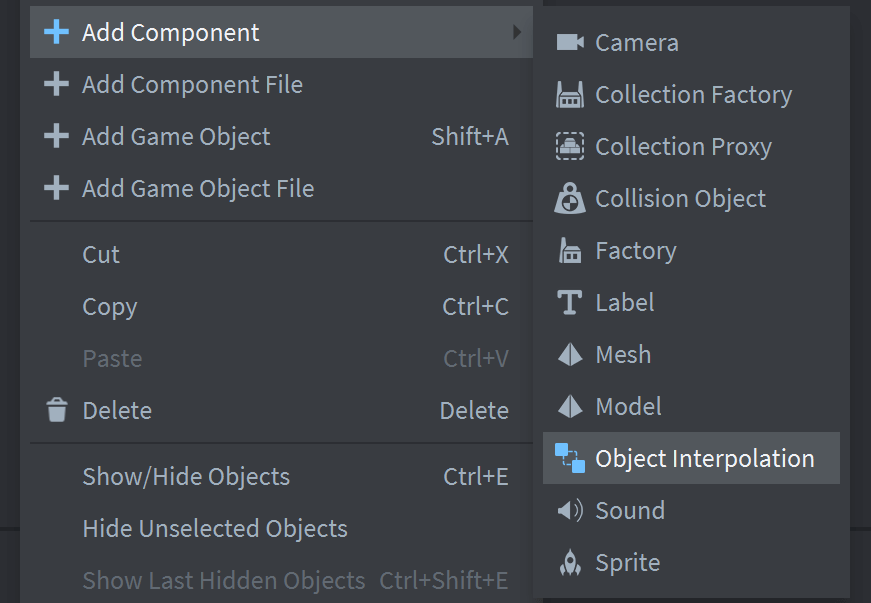
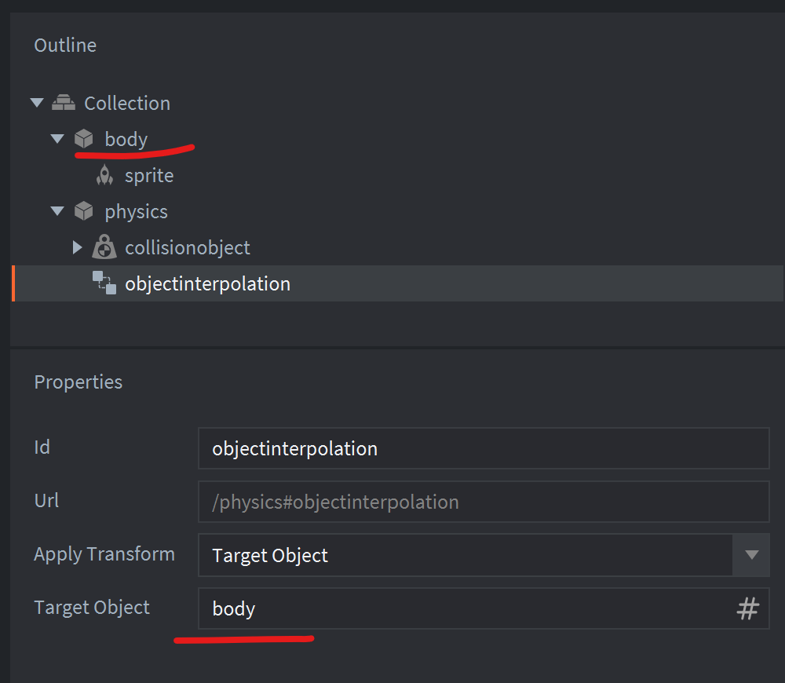

# Object Interpolation Component for Defold (PREVIEW)

This component for the Defold game engine allows you to interpolate the position and rotation of a game object between fixed update steps. 

Use cases:
- Smoothing the movement of objects with `collisionobject` components and 2D/3D physics working in `fixed time step` mode.
- Smoothing the movement of objects moved by the `fixed_update(self, dt)` function in scripts.

## Setup

Add this extension as a dependency to your `game.project` and click `Project` / `Fetch Libraries`:

    https://github.com/indiesoftby/defold-object-interpolation/archive/main.zip

It makes available a new component called `Object Interpolation`, which you can add to any game object:



## Component Modes

The default operation mode is `None`. In this mode, the component will not affect the object's movement, but it calculates interpolated values for subsequent use. The values are available through the `position` and `rotation` properties (see below).

The most useful mode is `Target Object`. In this mode, the component will move the object you specify in the `Target Object` property, applying interpolated values to it. You can use relative and absolute paths as the object id (like in the `go.get_id()` script function).

## Component Properties

### Read Only

- `apply_transform` (number) - The mode of the component (`object_interpolation.APPLY_TRANSFORM_NONE` - only interpolates values, `object_interpolation.APPLY_TRANSFORM_TARGET` - apply interpolated values to the target game object).
- `target_object` (hash) - The game object identifier that will be moved.

### Read/Write

- `position` (vmath.vector3) - The interpolated position of the game object. If you set this property, the component will reset the position interpolation and start from the new position.
- `rotation` (vmath.quat) - The interpolated rotation of the game object. If you set this property, the component will reset the rotation interpolation and start from the new rotation.

How to use the properties:

```lua
-- Get current mode:
print(go.get("#objectinterpolation", "apply_transform")) -- number
print(go.get("#objectinterpolation", "target_object")) -- hash

-- Get interpolated values:
print(go.get("#objectinterpolation", "position")) -- vmath.vector3
print(go.get("#objectinterpolation", "rotation")) -- vmath.quat
```

## Component Messages

- `set_apply_transform` (hash) - Change the transform mode and target game object, if needed, the message params are:
    - `apply_transform` (number) - The mode of the component (`object_interpolation.APPLY_TRANSFORM_NONE` - only interpolates values, `object_interpolation.APPLY_TRANSFORM_TARGET` - apply interpolated values to the target game object).
    - `target_object` (hash) - The game object identifier that will be moved (only if `apply_transform` is `object_interpolation.APPLY_TRANSFORM_TARGET`).

Example:

```lua
-- set new mode to "Target" and the target object to move
msg.post("#objectinterpolation", "set_apply_transform", { apply_transform = object_interpolation.APPLY_TRANSFORM_TARGET, target_object = hash("/object_to_move") })
-- or set to none to disable applying interpolated transform to the object
msg.post("#objectinterpolation", "set_apply_transform", { apply_transform = object_interpolation.APPLY_TRANSFORM_NONE })
```

## Lua Script API

Functions:

- `object_interpolation.set_enabled(enabled)` - Default is `true`, and when `false`, transformation will be applied to objects immediately as if you just copy position and rotation values from the source object to the target object. *Note: the component respects the engine game loop and has a lower priority than all other Defold engine system, and therefore, the position of the target object will lag exactly 1 frame (for 144hz display this is 1/144 ms and so on) from the position set in the last fixed update cycle (if you use it for collision objects and you enable physics debug view, you will notice this).*
- `object_interpolation.is_enabled()` - Check if the enabled flag is set.

Constants:

- `object_interpolation.APPLY_TRANSFORM_NONE` - Do not apply interpolation to the target object.
- `object_interpolation.APPLY_TRANSFORM_TARGET` - Apply interpolation to the target object.

## `game.project` Settings

Like any other Defold system, this component has a maximum limit on the number of objects that can be processed. The default `max_count` is 1024, but you can safely increase this value and set it with a large margin, as the system uses a small amount of memory per component instance.

```ini
[object_interpolation]
max_count = 1024
```

## Best Practices (from author's experience)

> [!TIP]
> I would like to remind that players do not only have 60Hz displays, so the best setup for your game loop is to run logic and update physics in fixed time step, and then display a interpolated visuals to viewers. This means that players with 120, 144, 240, and 360Hz displays will get the best gaming experience.

The best use case is to create a collection with 2 objects, where the first object has `collisionobject` and `objectinterpolation` components, and the second object displays the first one on screen and accordingly will have a `sprite` component or `model` component:



TODO Add project setup example for 2D and 3D.

## License

The code is licensed under the [MIT License](LICENSE).
